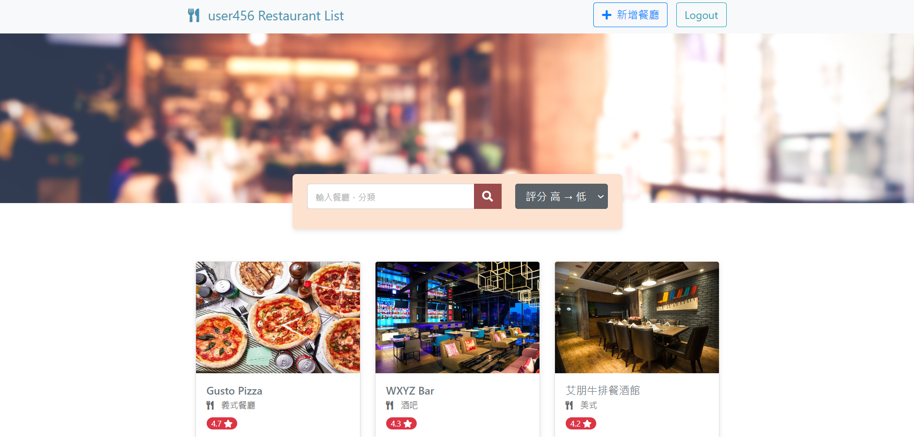

# My Restaurant List



:star: Display information of your favorite restaurants.

## Features
- Register the new account through local or facebook.
- Login into Restaurant list to manage your account. 
- Show all restaurants in homepage.
- Click on the restaurant's image for further information.
- Search restaurants by using keyword or sort filter.
- You can add, edit, delete any restaurant data.

## Getting Start

### Prerequisites
:white_check_mark: Be sure that Node.js and npm are installed already. 

### Installing
:white_check_mark: Clone or download the project to your folder

```bash
git clone https://github.com/bft7658/restaurant_list
```

:white_check_mark: Open `Terminal` to install the required packages  

```bash
npm install
```

:white_check_mark: Set environment variable 

```bash
MONGODB_URI = "<your URI>"
```

:white_check_mark: Load the initial data

```bash
npm run seed
```

:white_check_mark: Start the server after install finished

```bash
npm run dev
```

:white_check_mark: Run the browser when your `Terminal` shows the link 

```bash
This website is running on http://localhost:3000
```

:white_check_mark: Create a new account or use seed accounts below to test any function

```bash
email: user1@example.com
password: 12345678
```
```bash
email: user2@example.com
password: 12345678
```

:white_check_mark: Stop using browser by

```bash
Ctrl + c
```

## Development Tools
- Node.js 16.14.0
- Express 4.17.3
- express-handlebars 4.0.2
- Bootstrap 5.1.3
- Font-awesome 5.8.1
- MongoDB
- mongoose 6.1.6
- express-session 1.17.1
- passport 0.4.1
- bcryptjs 2.4.3
- dotenv 8.2.0